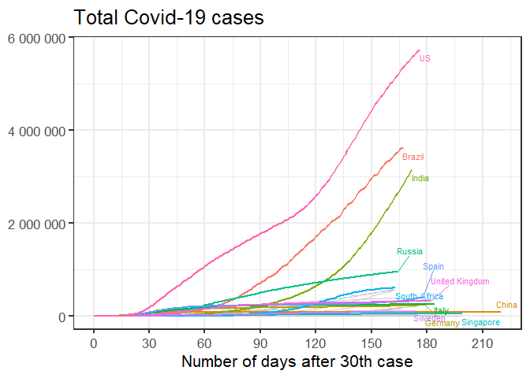
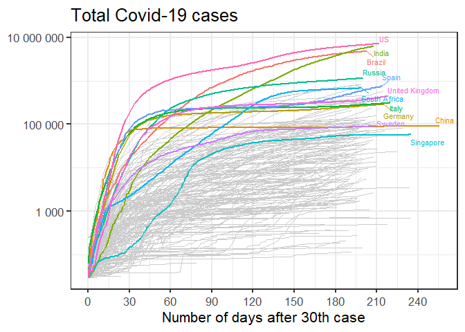
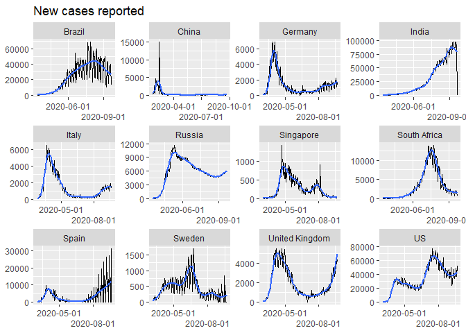
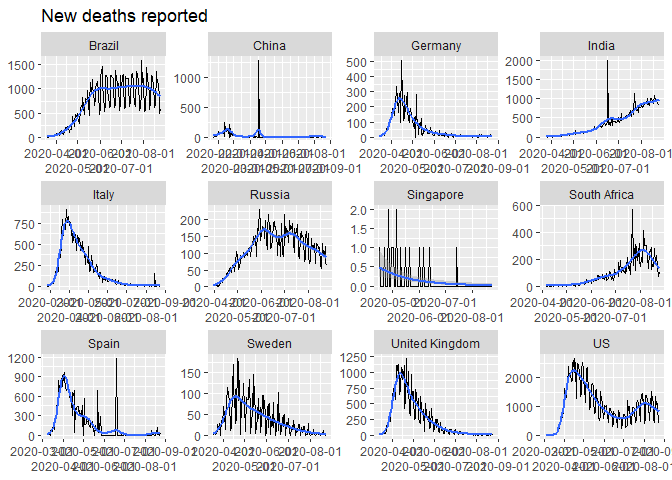
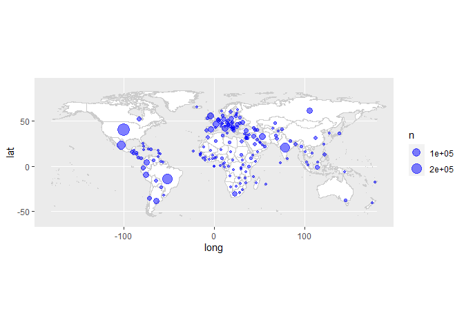

<!-- README.md is generated from README.Rmd. Please edit that file -->

covid-19
========

<!-- badges: start -->
<!-- badges: end -->

This is another analysis of the outbreak of [Coronavirus / Covid-19
disease](https://en.wikipedia.org/wiki/Coronavirus_disease_2019).

Many others have done excellent analysis, and my attempts are
specifically trying to add flavour to the statistics in South Africa.

Data source
-----------

The data source is [a repository maintained by Johns Hopkins
University](https://github.com/CSSEGISandData/COVID-19). The data is
updated once per day.

Last updated at 2020-09-30 05:05:14

Total cases
-----------

    #> # A tibble: 10 x 5
    #> # Groups:   country [1]
    #>    country      date         lat  long  cases
    #>    <chr>        <date>     <dbl> <dbl>  <dbl>
    #>  1 South Africa 2020-09-20 -30.6  22.9 661211
    #>  2 South Africa 2020-09-21 -30.6  22.9 661936
    #>  3 South Africa 2020-09-22 -30.6  22.9 663282
    #>  4 South Africa 2020-09-23 -30.6  22.9 665188
    #>  5 South Africa 2020-09-24 -30.6  22.9 667049
    #>  6 South Africa 2020-09-25 -30.6  22.9 668529
    #>  7 South Africa 2020-09-26 -30.6  22.9 669498
    #>  8 South Africa 2020-09-27 -30.6  22.9 670766
    #>  9 South Africa 2020-09-28 -30.6  22.9 671669
    #> 10 South Africa 2020-09-29 -30.6  22.9 672572

### Linear scale

Using a linear scale it’s easiest to see the relative scale of the worst
affected countries, but it’s hard to distinguish the countries that were
affected later.

<!-- -->

### Logarithmic scale

Using a logarithmic scale it’s easier to discern whether the pandemic is
still in the exponential growth phase. On this scale, a straight line
indicates exponential growth.

<!-- -->

New cases
---------

<!-- -->

<!-- -->

Regional distribution of Covid-19 cases
---------------------------------------

<!-- -->

Total number of deaths
----------------------

    #> # A tibble: 10 x 3
    #> # Groups:   country [1]
    #>    country      date       deaths
    #>    <chr>        <date>      <dbl>
    #>  1 South Africa 2020-09-20  15953
    #>  2 South Africa 2020-09-21  15992
    #>  3 South Africa 2020-09-22  16118
    #>  4 South Africa 2020-09-23  16206
    #>  5 South Africa 2020-09-24  16283
    #>  6 South Africa 2020-09-25  16312
    #>  7 South Africa 2020-09-26  16376
    #>  8 South Africa 2020-09-27  16398
    #>  9 South Africa 2020-09-28  16586
    #> 10 South Africa 2020-09-29  16667

### Linear scale

<!-- -->

### Logarithmic scale

<!-- -->

New deaths
----------

<!-- -->

Regional distribution of Covid-19 deaths
----------------------------------------

<!-- -->
