<!-- README.md is generated from README.Rmd. Please edit that file -->

# covid-19

<!-- badges: start -->

<!-- badges: end -->

This is another analysis of the outbreak of [Coronavirus / Covid-19
disease](https://en.wikipedia.org/wiki/Coronavirus_disease_2019).

Many others have done excellent analysis, and my attempts are
specifically trying to add flavour to the statistics in South Africa.

## Data source

The data source is [a repository maintained by Johns Hopkins
University](https://github.com/CSSEGISandData/COVID-19). The data is
updated once per day.

Last updated at 2020-05-18 13:54:48

## Total cases

    #> # A tibble: 10 x 5
    #> # Groups:   country [1]
    #>    country      date         lat  long cases
    #>    <chr>        <date>     <dbl> <dbl> <dbl>
    #>  1 South Africa 2020-05-08 -30.6  22.9  8895
    #>  2 South Africa 2020-05-09 -30.6  22.9  9420
    #>  3 South Africa 2020-05-10 -30.6  22.9 10015
    #>  4 South Africa 2020-05-11 -30.6  22.9 10652
    #>  5 South Africa 2020-05-12 -30.6  22.9 11350
    #>  6 South Africa 2020-05-13 -30.6  22.9 12074
    #>  7 South Africa 2020-05-14 -30.6  22.9 12739
    #>  8 South Africa 2020-05-15 -30.6  22.9 13524
    #>  9 South Africa 2020-05-16 -30.6  22.9 14355
    #> 10 South Africa 2020-05-17 -30.6  22.9 15515

### Linear scale

Using a linear scale it’s easiest to see the relative scale of the worst
affected countries, but it’s hard to distinguish the countries that were
affected later.

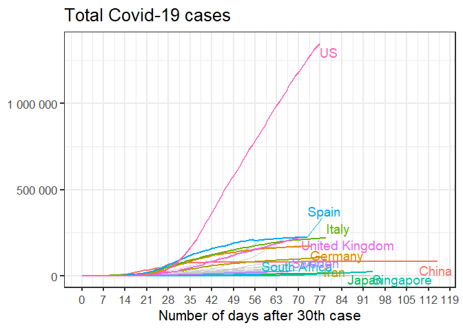<!-- -->

### Logarithmic scale

Using a logarithmic scale it’s easier to discern whether the pandemic is
still in the exponential growth phase. On this scale, a straight line
indicates exponential growth.

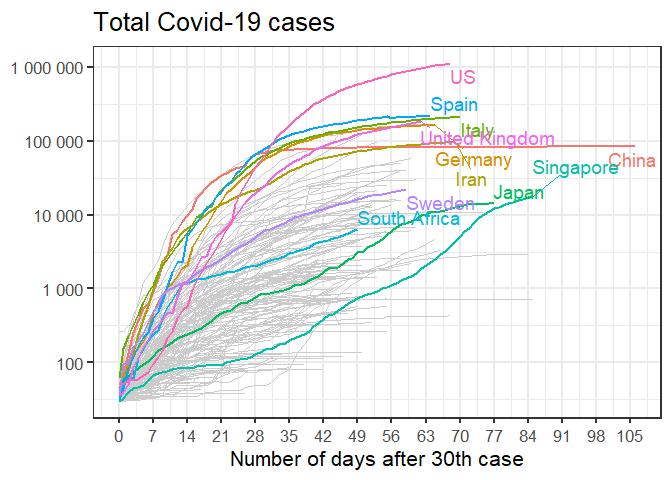<!-- -->

## New cases

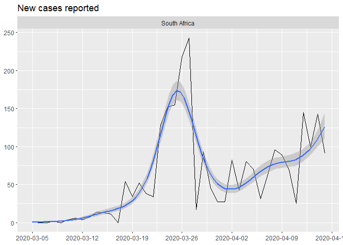<!-- -->

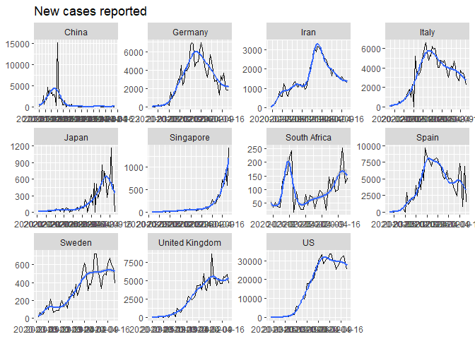<!-- -->

## Regional distribution of Covid-19 cases

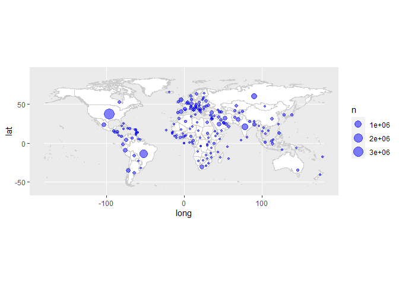<!-- -->

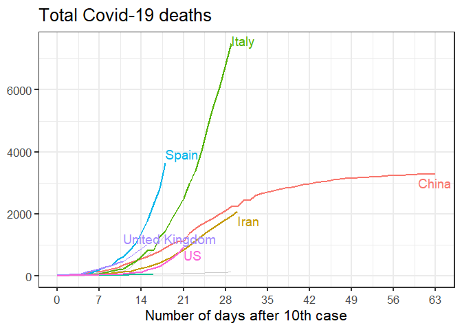<!-- -->

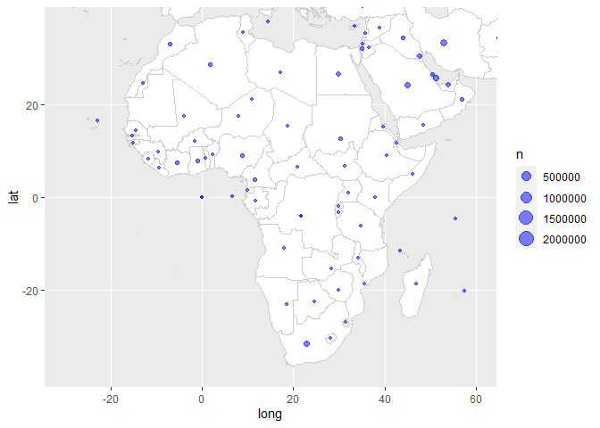<!-- -->

## Total number of deaths

    #> # A tibble: 10 x 3
    #> # Groups:   country [1]
    #>    country      date       deaths
    #>    <chr>        <date>      <dbl>
    #>  1 South Africa 2020-05-08    178
    #>  2 South Africa 2020-05-09    186
    #>  3 South Africa 2020-05-10    194
    #>  4 South Africa 2020-05-11    206
    #>  5 South Africa 2020-05-12    206
    #>  6 South Africa 2020-05-13    219
    #>  7 South Africa 2020-05-14    238
    #>  8 South Africa 2020-05-15    247
    #>  9 South Africa 2020-05-16    261
    #> 10 South Africa 2020-05-17    264

### Linear scale

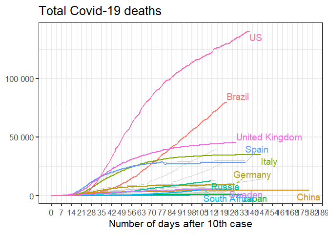<!-- -->

### Logarithmic scale

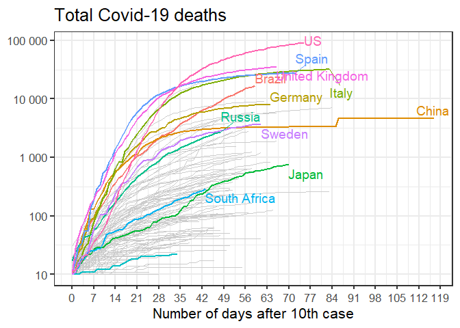<!-- -->

## New deaths

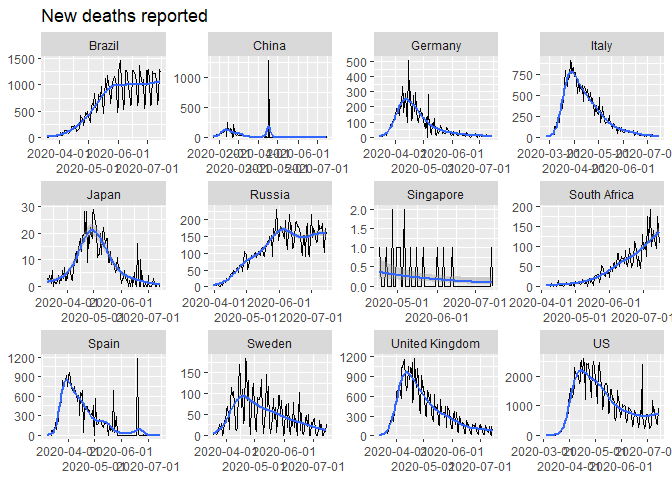<!-- -->

## Regional distribution of Covid-19 deaths

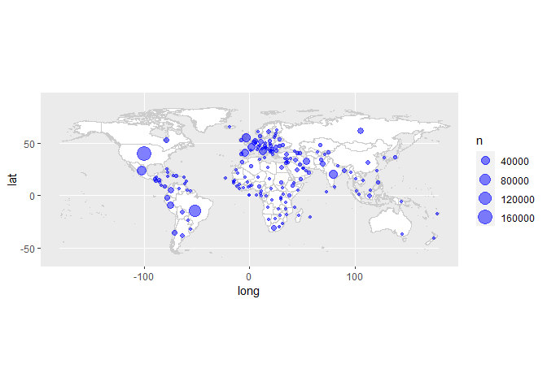<!-- -->

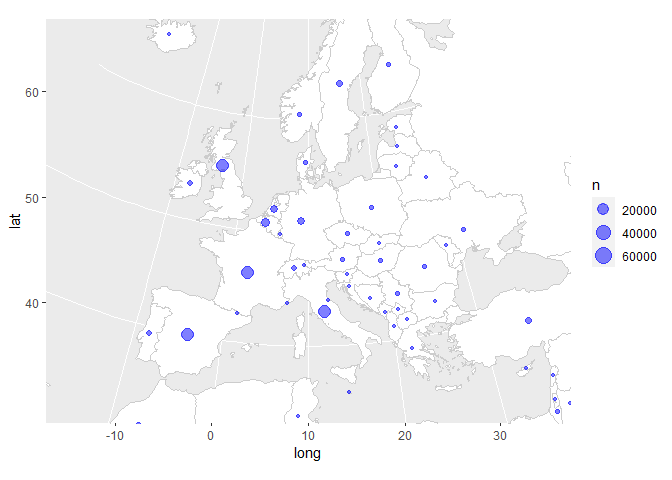<!-- -->

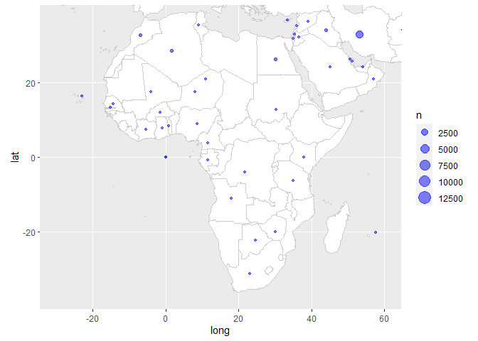<!-- -->
