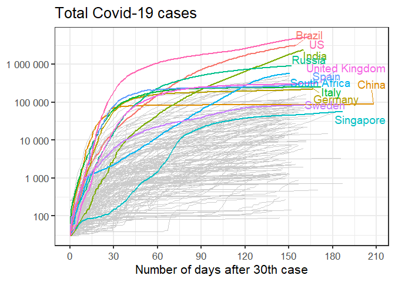
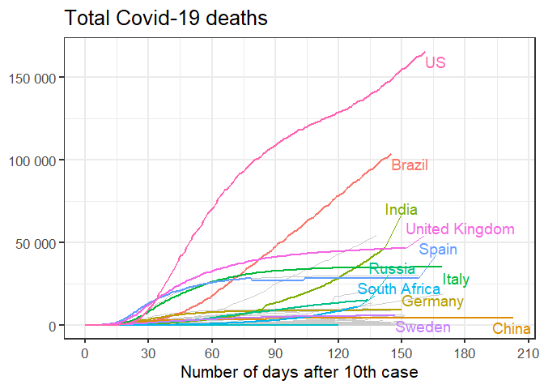
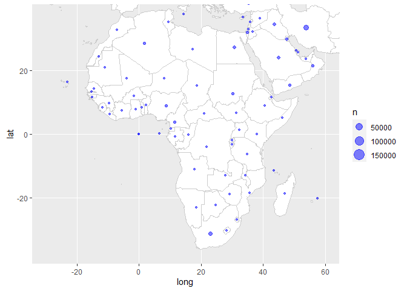

<!-- README.md is generated from README.Rmd. Please edit that file -->

# covid-19

<!-- badges: start -->

<!-- badges: end -->

This is another analysis of the outbreak of [Coronavirus / Covid-19
disease](https://en.wikipedia.org/wiki/Coronavirus_disease_2019).

Many others have done excellent analysis, and my attempts are
specifically trying to add flavour to the statistics in South Africa.

## Data source

The data source is [a repository maintained by Johns Hopkins
University](https://github.com/CSSEGISandData/COVID-19). The data is
updated once per day.

Last updated at 2020-06-10 05:32:49

## Total cases

    #> # A tibble: 10 x 5
    #> # Groups:   country [1]
    #>    country      date         lat  long cases
    #>    <chr>        <date>     <dbl> <dbl> <dbl>
    #>  1 South Africa 2020-05-31 -30.6  22.9 32683
    #>  2 South Africa 2020-06-01 -30.6  22.9 34357
    #>  3 South Africa 2020-06-02 -30.6  22.9 35812
    #>  4 South Africa 2020-06-03 -30.6  22.9 37525
    #>  5 South Africa 2020-06-04 -30.6  22.9 40792
    #>  6 South Africa 2020-06-05 -30.6  22.9 43434
    #>  7 South Africa 2020-06-06 -30.6  22.9 45973
    #>  8 South Africa 2020-06-07 -30.6  22.9 48285
    #>  9 South Africa 2020-06-08 -30.6  22.9 50879
    #> 10 South Africa 2020-06-09 -30.6  22.9 52991

### Linear scale

Using a linear scale it’s easiest to see the relative scale of the worst
affected countries, but it’s hard to distinguish the countries that were
affected later.

<!-- -->

### Logarithmic scale

Using a logarithmic scale it’s easier to discern whether the pandemic is
still in the exponential growth phase. On this scale, a straight line
indicates exponential growth.

<!-- -->

## New cases

<!-- -->

<!-- -->

## Regional distribution of Covid-19 cases

<!-- -->

<!-- -->

<!-- -->

## Total number of deaths

    #> # A tibble: 10 x 3
    #> # Groups:   country [1]
    #>    country      date       deaths
    #>    <chr>        <date>      <dbl>
    #>  1 South Africa 2020-05-31    683
    #>  2 South Africa 2020-06-01    705
    #>  3 South Africa 2020-06-02    755
    #>  4 South Africa 2020-06-03    792
    #>  5 South Africa 2020-06-04    848
    #>  6 South Africa 2020-06-05    908
    #>  7 South Africa 2020-06-06    952
    #>  8 South Africa 2020-06-07    998
    #>  9 South Africa 2020-06-08   1080
    #> 10 South Africa 2020-06-09   1162

### Linear scale

<!-- -->

### Logarithmic scale

<!-- -->

## New deaths

<!-- -->

## Regional distribution of Covid-19 deaths

<!-- -->

<!-- -->

<!-- -->
