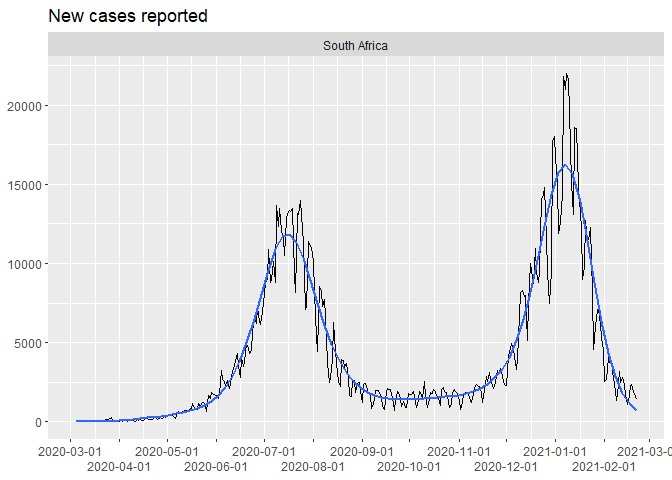

<!-- README.md is generated from README.Rmd. Please edit that file -->

covid-19
========

<!-- badges: start -->
<!-- badges: end -->

This is another analysis of the outbreak of [Coronavirus / Covid-19
disease](https://en.wikipedia.org/wiki/Coronavirus_disease_2019).

Many others have done excellent analysis, and my attempts are
specifically trying to add flavour to the statistics in South Africa.

Data source
-----------

The data source is [a repository maintained by Johns Hopkins
University](https://github.com/CSSEGISandData/COVID-19). The data is
updated once per day.

Last updated at 2020-11-10 08:36:54

Total cases
-----------

    #> # A tibble: 10 x 5
    #> # Groups:   country [1]
    #>    country      date         lat  long  cases
    #>    <chr>        <date>     <dbl> <dbl>  <dbl>
    #>  1 South Africa 2020-10-31 -30.6  22.9 725452
    #>  2 South Africa 2020-11-01 -30.6  22.9 726823
    #>  3 South Africa 2020-11-02 -30.6  22.9 727595
    #>  4 South Africa 2020-11-03 -30.6  22.9 728836
    #>  5 South Africa 2020-11-04 -30.6  22.9 730548
    #>  6 South Africa 2020-11-05 -30.6  22.9 732414
    #>  7 South Africa 2020-11-06 -30.6  22.9 734175
    #>  8 South Africa 2020-11-07 -30.6  22.9 735906
    #>  9 South Africa 2020-11-08 -30.6  22.9 737278
    #> 10 South Africa 2020-11-09 -30.6  22.9 738525

### Linear scale

Using a linear scale it’s easiest to see the relative scale of the worst
affected countries, but it’s hard to distinguish the countries that were
affected later.

<!-- -->

### Logarithmic scale

Using a logarithmic scale it’s easier to discern whether the pandemic is
still in the exponential growth phase. On this scale, a straight line
indicates exponential growth.

<!-- -->

New cases
---------

<!-- -->

<!-- -->

Regional distribution of Covid-19 cases
---------------------------------------

<!-- -->

Total number of deaths
----------------------

    #> # A tibble: 10 x 3
    #> # Groups:   country [1]
    #>    country      date       deaths
    #>    <chr>        <date>      <dbl>
    #>  1 South Africa 2020-10-31  19276
    #>  2 South Africa 2020-11-01  19411
    #>  3 South Africa 2020-11-02  19465
    #>  4 South Africa 2020-11-03  19539
    #>  5 South Africa 2020-11-04  19585
    #>  6 South Africa 2020-11-05  19677
    #>  7 South Africa 2020-11-06  19749
    #>  8 South Africa 2020-11-07  19789
    #>  9 South Africa 2020-11-08  19809
    #> 10 South Africa 2020-11-09  19845

### Linear scale

<!-- -->

### Logarithmic scale

<!-- -->

New deaths
----------

<!-- -->

Regional distribution of Covid-19 deaths
----------------------------------------

<!-- -->
