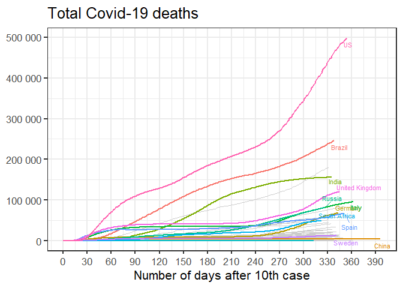

<!-- README.md is generated from README.Rmd. Please edit that file -->

# covid-19

<!-- badges: start -->

<!-- badges: end -->

This is another analysis of the outbreak of [Coronavirus / Covid-19
disease](https://en.wikipedia.org/wiki/Coronavirus_disease_2019).

Many others have done excellent analysis, and my attempts are
specifically trying to add flavour to the statistics in South Africa.

## Data source

The data source is [a repository maintained by Johns Hopkins
University](https://github.com/CSSEGISandData/COVID-19). The data is
updated once per day.

Last updated at 2020-08-26 06:05:33

## Total cases

    #> # A tibble: 10 x 5
    #> # Groups:   country [1]
    #>    country      date         lat  long  cases
    #>    <chr>        <date>     <dbl> <dbl>  <dbl>
    #>  1 South Africa 2020-08-16 -30.6  22.9 587345
    #>  2 South Africa 2020-08-17 -30.6  22.9 589886
    #>  3 South Africa 2020-08-18 -30.6  22.9 592144
    #>  4 South Africa 2020-08-19 -30.6  22.9 596060
    #>  5 South Africa 2020-08-20 -30.6  22.9 599940
    #>  6 South Africa 2020-08-21 -30.6  22.9 603338
    #>  7 South Africa 2020-08-22 -30.6  22.9 607045
    #>  8 South Africa 2020-08-23 -30.6  22.9 609773
    #>  9 South Africa 2020-08-24 -30.6  22.9 611450
    #> 10 South Africa 2020-08-25 -30.6  22.9 613017

### Linear scale

Using a linear scale it’s easiest to see the relative scale of the worst
affected countries, but it’s hard to distinguish the countries that were
affected later.

<!-- -->

### Logarithmic scale

Using a logarithmic scale it’s easier to discern whether the pandemic is
still in the exponential growth phase. On this scale, a straight line
indicates exponential growth.

<!-- -->

## New cases

<!-- -->

<!-- -->

## Regional distribution of Covid-19 cases

<!-- -->

## Total number of deaths

    #> # A tibble: 10 x 3
    #> # Groups:   country [1]
    #>    country      date       deaths
    #>    <chr>        <date>      <dbl>
    #>  1 South Africa 2020-08-16  11839
    #>  2 South Africa 2020-08-17  11982
    #>  3 South Africa 2020-08-18  12264
    #>  4 South Africa 2020-08-19  12423
    #>  5 South Africa 2020-08-20  12618
    #>  6 South Africa 2020-08-21  12843
    #>  7 South Africa 2020-08-22  12987
    #>  8 South Africa 2020-08-23  13059
    #>  9 South Africa 2020-08-24  13159
    #> 10 South Africa 2020-08-25  13308

### Linear scale

<!-- -->

### Logarithmic scale

<!-- -->

## New deaths

<!-- -->

## Regional distribution of Covid-19 deaths

<!-- -->
