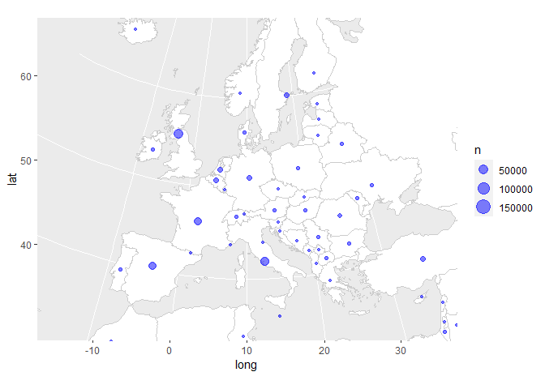

<!-- README.md is generated from README.Rmd. Please edit that file -->

# covid-19

<!-- badges: start -->

<!-- badges: end -->

This is another analysis of the outbreak of [Coronavirus / Covid-19
disease](https://en.wikipedia.org/wiki/Coronavirus_disease_2019).

Many others have done excellent analysis, and my attempts are
specifically trying to add flavour to the statistics in South Africa.

## Data source

The data source is [a repository maintained by Johns Hopkins
University](https://github.com/CSSEGISandData/COVID-19). The data is
updated once per day.

Last updated at 2020-07-09 06:47:20

## Total cases

    #> `summarise()` regrouping output by 'country' (override with `.groups` argument)

    #> # A tibble: 10 x 5
    #> # Groups:   country [1]
    #>    country      date         lat  long  cases
    #>    <chr>        <date>     <dbl> <dbl>  <dbl>
    #>  1 South Africa 2020-06-29 -30.6  22.9 144264
    #>  2 South Africa 2020-06-30 -30.6  22.9 151209
    #>  3 South Africa 2020-07-01 -30.6  22.9 159333
    #>  4 South Africa 2020-07-02 -30.6  22.9 168061
    #>  5 South Africa 2020-07-03 -30.6  22.9 177124
    #>  6 South Africa 2020-07-04 -30.6  22.9 187977
    #>  7 South Africa 2020-07-05 -30.6  22.9 196750
    #>  8 South Africa 2020-07-06 -30.6  22.9 205721
    #>  9 South Africa 2020-07-07 -30.6  22.9 215855
    #> 10 South Africa 2020-07-08 -30.6  22.9 224665

### Linear scale

Using a linear scale it’s easiest to see the relative scale of the worst
affected countries, but it’s hard to distinguish the countries that were
affected later.

<!-- -->

### Logarithmic scale

Using a logarithmic scale it’s easier to discern whether the pandemic is
still in the exponential growth phase. On this scale, a straight line
indicates exponential growth.

<!-- -->

## New cases

    #> `summarise()` regrouping output by 'country' (override with `.groups` argument)

<!-- -->

    #> `summarise()` regrouping output by 'country' (override with `.groups` argument)

<!-- -->

## Regional distribution of Covid-19 cases

<!-- -->

<!-- -->

<!-- -->

## Total number of deaths

    #> `summarise()` regrouping output by 'country' (override with `.groups` argument)

    #> # A tibble: 10 x 3
    #> # Groups:   country [1]
    #>    country      date       deaths
    #>    <chr>        <date>      <dbl>
    #>  1 South Africa 2020-06-29   2529
    #>  2 South Africa 2020-06-30   2657
    #>  3 South Africa 2020-07-01   2749
    #>  4 South Africa 2020-07-02   2844
    #>  5 South Africa 2020-07-03   2952
    #>  6 South Africa 2020-07-04   3026
    #>  7 South Africa 2020-07-05   3199
    #>  8 South Africa 2020-07-06   3310
    #>  9 South Africa 2020-07-07   3502
    #> 10 South Africa 2020-07-08   3602

### Linear scale

<!-- -->

### Logarithmic scale

<!-- -->

## New deaths

    #> `summarise()` regrouping output by 'country' (override with `.groups` argument)

<!-- -->

## Regional distribution of Covid-19 deaths

<!-- -->

<!-- -->

<!-- -->
