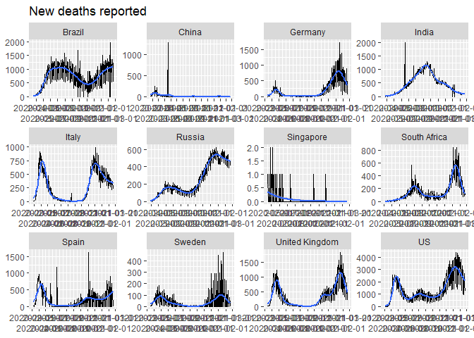
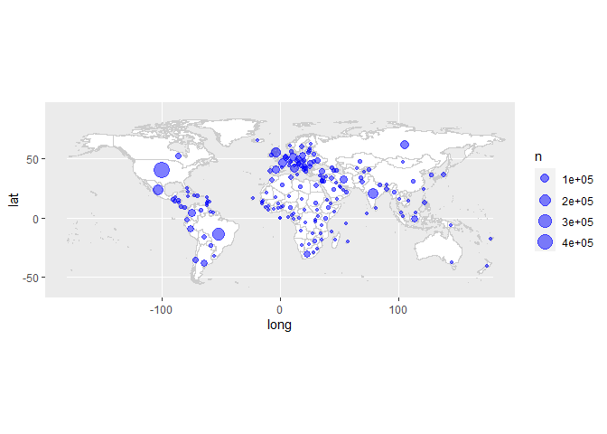

<!-- README.md is generated from README.Rmd. Please edit that file -->

# covid-19

<!-- badges: start -->
<!-- badges: end -->

This is another analysis of the outbreak of [Coronavirus / Covid-19
disease](https://en.wikipedia.org/wiki/Coronavirus_disease_2019).

Many others have done excellent analysis, and my attempts are
specifically trying to add flavour to the statistics in South Africa.

## Data source

The data source is [a repository maintained by Johns Hopkins
University](https://github.com/CSSEGISandData/COVID-19). The data is
updated once per day.

Last updated at 2021-02-22 07:18:10

## Total cases

    #> # A tibble: 10 x 5
    #> # Groups:   country [1]
    #>    country      date         lat  long   cases
    #>    <chr>        <date>     <dbl> <dbl>   <dbl>
    #>  1 South Africa 2021-02-12 -30.6  22.9 1487681
    #>  2 South Africa 2021-02-13 -30.6  22.9 1490063
    #>  3 South Africa 2021-02-14 -30.6  22.9 1491807
    #>  4 South Africa 2021-02-15 -30.6  22.9 1492909
    #>  5 South Africa 2021-02-16 -30.6  22.9 1494119
    #>  6 South Africa 2021-02-17 -30.6  22.9 1496439
    #>  7 South Africa 2021-02-18 -30.6  22.9 1498766
    #>  8 South Africa 2021-02-19 -30.6  22.9 1500677
    #>  9 South Africa 2021-02-20 -30.6  22.9 1502367
    #> 10 South Africa 2021-02-21 -30.6  22.9 1503796

### Linear scale

Using a linear scale it’s easiest to see the relative scale of the worst
affected countries, but it’s hard to distinguish the countries that were
affected later.

<!-- -->

### Logarithmic scale

Using a logarithmic scale it’s easier to discern whether the pandemic is
still in the exponential growth phase. On this scale, a straight line
indicates exponential growth.

<!-- -->

## New cases

<!-- -->

<!-- -->

## Regional distribution of Covid-19 cases

<!-- -->

## Total number of deaths

    #> # A tibble: 10 x 3
    #> # Groups:   country [1]
    #>    country      date       deaths
    #>    <chr>        <date>      <dbl>
    #>  1 South Africa 2021-02-12  47670
    #>  2 South Africa 2021-02-13  47821
    #>  3 South Africa 2021-02-14  47899
    #>  4 South Africa 2021-02-15  48094
    #>  5 South Africa 2021-02-16  48313
    #>  6 South Africa 2021-02-17  48478
    #>  7 South Africa 2021-02-18  48708
    #>  8 South Africa 2021-02-19  48859
    #>  9 South Africa 2021-02-20  48940
    #> 10 South Africa 2021-02-21  49053

### Linear scale

<!-- -->

### Logarithmic scale

<!-- -->

## New deaths

<!-- -->

## Regional distribution of Covid-19 deaths

<!-- -->
